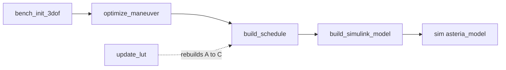

# ASTERIA 4v4 bench — GNC runbook

**Status:** validated in simulation, embedded C generated and verified on the host, awaiting hardware.
**Companion documents:** `ICD.md` (what the electronics must provide), `TOOLCHAIN.md` (replay and identification tools, with their validation evidence).

## 1. Scope and decisions

The package flies the 4v4 bench axially and in yaw, closed loop, from a 60 mm start gap to bare face contact at −20 ± 10 mm/s. Lateral motion is passively stable and only monitored. The force model is a calibrated analytical pole model, not an electromagnetic simulation; **calibrating it on the 1v1 rig is mandatory before any hardware run**.

| Decision | Value | Why |
| --- | --- | --- |
| Rig | 4v4 interface, chaser on the planar air bearing; 1v1 kept as the calibration fixture | Team |
| Drive | Target coils at fixed +0.427 A, chaser coils modulated ±0.427 A, two current-controlled supplies | Symmetric drive is attract-only and cannot brake |
| Lateral | Out of scope for the first test; coil cant = 0 | PM decision |
| Arrival velocity | −20 ± 10 mm/s at bare contact, no capture mechanism | GNC |
| Start gap | 60 mm, then 80 and 100 mm after each passes on hardware | Tilt tolerance shrinks with gap |
| Terminal guidance | Path-following inside 30 mm: reference taken at the estimated gap, not the current time | Removed the fast-arrival bias (§7) |
| Anti-windup | None; saturation is a plain limit, the EKF is fed measured current | GNC |
| ToF latency compensation | On (20 ms) | Physically correct; no measurable performance effect (§7) |
| Force model | Analytical placeholder + 1v1 calibration | External EM simulation fell through |
| Processor | Cortex-M7 class, double-precision FPU | Code is double precision (§8) |

## 2. Quick start

1. MATLAB R2026a with the toolboxes listed in `README.md`.
2. From the repository root: `startup`, then `run_all_tests`. Expected: `plant`, `replay`, `precision`, `sil`, `simulink` **pass**; `ekf`, `closed_loop`, `envelope`, `update_lut` **ran** (they print tables to read, not a verdict).
3. The pipeline, in order, after any parameter change:

`bench_init_3dof` prints which force model is loaded ("geometry model, UNCALIBRATED" or the calibration file). Read that line every time. The Monte Carlo (`monte_carlo`, 300 runs, ~75 s on a parallel pool) takes its force uncertainty from `P.mc.fs_range`: `[0.3 3]` uncalibrated, `[0.8 1.25]` after calibration.

## 3. How it works

**Plant.** Three planar degrees of freedom `[x y θ]`. Forces and torques from `asteria_wrench`: every chaser coil pole interacting with every target coil pole (64 terms). Rank 2: the four currents command axial force and yaw; lateral force is tied to yaw.

**Estimator.** 10-state EKF `[x y θ vx vy ω dx dy dθ bg]`: pose, rates, three disturbance accelerations (the table tilt lives in `dx`), gyro bias. Inputs: two recessed ToF sensors (30 Hz), a lateral sensor (30 Hz), the gyro (500 Hz), and the measured coil currents. Range measurements are predicted from the pose one sensor latency ago.

**Controller.** Gain-scheduled LQR on `[x θ vx ω]` (40 gaps, 0.5–100 mm), plus feedforward from the reference and a disturbance trim. Above 30 mm the reference is indexed by time; inside 30 mm it is indexed by the estimated gap.

**Reference.** A speed profile shaped for estimability: authority-limited acceleration far out, then a speed ramp over the last 30 mm to −20.7 mm/s at contact, so braking spans ~0.75 s and ~23 range samples rather than a few milliseconds.

**Embedded code.** `gnc_step` is the same EKF and controller, rewritten for code generation and verified equal to the reference to 1e-11 (§8).

## 4. The force model: generation and trust

### What it is

Each solenoid is two magnetic poles, one at each core face. From the coil geometry (1289 turns, 3.9 mm iron core, 30 mm long, 17.6 Ω): shape-limited apparent susceptibility ~12.4, moment **0.75 A·m² per amp**, pole strength **25.05 A·m per amp**. Core flux at maximum current is 0.24 T, six times below saturation, so the model is linear in current. Each pole pair contributes a softened inverse-square force:

$$\mathbf{F}_{ab} = \frac{\mu_0\, q_a q_b}{4\pi}\,\frac{\mathbf{r}_{ab}}{\left(|\mathbf{r}_{ab}|^2 + x_0^2\right)^{3/2}}$$

The softening length `x0` (3.9 mm nominal) is the one phenomenological parameter. `update_lut` fits `q` and `x0` from 1v1 measurements; everything 4v4 follows. A lookup table was rejected because the controller needs lateral and yaw derivatives across three pose coordinates and four currents, which no test campaign could tabulate.

### How far to trust it

- **Solid:** the far field (converges to the exact dipole law, within 1% at 100 mm); linearity in current; the rank-2 structure and mode types, which follow from geometry, not constants. The code is verified by `test_plant`.
- **Weak:** absolute scale (factor 0.5–2 uncalibrated, fixed by fitting `q`); near-field shape below ~10 mm (fixed in part by fitting `x0`); the off-axis field (untested until T3/T4); coil-to-coil variation (T0).
- **Not modelled:** induced magnetisation between cores (dominant in the last millimetres), hysteresis, eddy currents in brackets, stray steel, Earth's field torque (up to ~10% of yaw authority; align the docking axis with magnetic north), temperature (harmless under current control), coil misalignment (1° leaks ~1.7% of axial force into lateral and yaw).

**Bottom line:** uncalibrated, a physics-anchored factor-of-two estimate; calibrated on the 1v1 rig, an expected ±2.5% measurement error far-field and ±4% near contact, plus the model-form error the fit's RMS misfit reports. The loop needs ±12–15%. That is a prediction until T1 is run.

### The campaign that generates and validates it

| Step | Rig | Measures | Pass |
| --- | --- | --- | --- |
| T0 Coil characterisation | each coil, Hall probe on axis (take ±i, use half the difference to cancel Earth's field) | R, L, q per coil | all coils within ±5% in q |
| T1 Axial force map | 1v1 on a 0.1 mg balance, coil on a 10–15 cm non-magnetic riser, gap zero set with a feeler gauge | force at gaps 2–100 mm × currents ±0.1/0.2/0.4 A, 3 repeats | RMS misfit < 5% at 5–100 mm; linear in current within 2% |
| T2 Near-contact map | same, 0–10 mm every 0.5 mm, current up/down sweeps | hysteresis, force at zero chaser current | records the gap below which misfit exceeds 15% |
| T3 Lateral stiffness | 1v1 on the air bearing, axially stopped | lateral oscillation period at 5–40 mm | within ±20% of the model |
| T4 Superposition | 4v4, pairs alone vs together | sum of pairs vs all four | within 5% |
| T5 Dynamic response | air bearing, current steps and reversals | force lag beyond L/R | < ~1 ms |
| T6 In-situ identification | 4v4 closed loop at a fixed standoff, pseudo-random current injection | local force-per-amp, stiffness, yaw torque-per-amp | within ±15% of the model Jacobians |
| T7 FEMM cross-check | axisymmetric 1v1 with the real B–H curve | where the pole model departs below 10 mm | within 10% above 10 mm |

T1 is saved as CSV with header `gap_m,i_chaser_A,i_target_A,force_N` (attractive positive) and fitted with `update_lut('file.csv')`, which writes `asteria_calibration.mat` and rebuilds the reference and gains. Delete that file to return to the geometry model.

### Does it transfer to flight?

The method does; the numbers do not. Scaling every dimension by λ at fixed current density: acceleration authority grows ∝ λ (easier), but core flux also grows ∝ λ (closer to saturation). A 3× scale-up is still linear; beyond that, or with current pushed for authority, the linear pole model fails and a FEM force map with the real B–H curve becomes necessary. In orbit there is no balance: the ground-calibrated flight coils are corrected by an identification hold at a safe standoff and by an online force-scale estimate from the accelerometers. What changes beyond scale: two free bodies and 6-DoF coupling, no table tilt but orbit-varying Earth-field torque and stray moments from magnetorquers and wheels, different relative navigation, vacuum thermal, magnetic cleanliness. The ground campaign can claim the model form, the calibration method and the GNC architecture; it cannot claim flight performance numbers.

## 5. Before the first hardware run

1. **Calibrate** on the 1v1 rig (T1, then T0/T2 as available) and run `update_lut`. Re-run `monte_carlo` with `P.mc.fs_range` set to the real calibration uncertainty; that is the pass rate to quote.
2. **Weigh** the complete floating chaser and set `P.m`; take `P.J` from CAD or a bifilar pendulum.
3. **Level the table and measure the residual tilt**: release the float with the drives off, fit a parabola to range against time; acceleration = 2 × the quadratic term = 9.81 × sin(tilt). At 0.002° the float drifts ~7 cm in 20 s.
4. **Pick the start gap from the tilt.** Keep the tilt below the right-hand column:

| Start gap | Full authority | Tilt using all of it | Comfortable limit (30%) |
| --- | --- | --- | --- |
| 100 mm | 2.08e-3 m/s² | 0.0121° | 0.0036° |
| 80 mm | 3.44e-3 m/s² | 0.0201° | 0.0060° |
| 60 mm | 6.23e-3 m/s² | 0.0364° | 0.0109° |
| 40 mm | 1.46e-2 m/s² | 0.0854° | 0.0256° |

5. **Rig checks:** the checklist in `ICD.md` §7 (coil order, polarity, ToF recess, gyro sign, timing), plus driver drop measured into `P.drv.V_drop`, coil cooldown between runs, magnetic-north alignment, non-magnetic fasteners.

## 6. Tuning on hardware

Hardware tuning loops when model errors get absorbed into the filter's noise parameters. Five rules prevent it:

1. **Log everything raw; tune offline** with `replay_ekf` on the logs.
2. **Measure R once, at rest; never tune it.**
3. **Biased or coloured innovations are a model problem**, fixed in the model, never by raising Q.
4. **Each stage owns its parameters and freezes them.**
5. **Accept on statistics** (NIS, whiteness), not on how a plot looks.

| Stage | Setup | Sets, then freezes | Accepted when |
| --- | --- | --- | --- |
| S1 Sensors at rest | float clamped at gauge gaps 10/20/40/60 mm, drives off, 60 s each | ToF offset, scale and noise; gyro noise and bias; accel bias; INA offsets | range error < 0.5 mm after calibration |
| S2 Free drift | float free, drives off | table tilt (parabola + EKF, must agree); ToF latency **from the camera or the data-ready line** | NIS within bounds, innovations white |
| S3 Open-loop pulses | from 60 mm, known 1–2 s current profiles, soft stop ready | nothing in the filter: confirms force scale, sign, input delay | model trajectory within 10% of measured; otherwise back to `update_lut` |
| S4 Standoff hold | closed loop at 40/20/10 mm, detuned then nominal, pseudo-random injection | process noise `sig_a`, `sig_al`; gain margin (scale gains to 1.5×) | NIS within bounds; Jacobians within 15% (T6) |
| S5 Approaches | 10 runs from 60 mm | nothing: acceptance | arrival statistics inside the calibrated Monte Carlo |

NIS bounds for N samples: mean within 1 ± 2√(2/N); innovation autocorrelation within ±2/√N at every lag.

**Diagnostics, as measured by fault injection** (`test_replay`), not as first predicted:

| Symptom in the replay | Most likely cause | Fix |
| --- | --- | --- |
| ToF whiteness fails, mean passes, camera disagrees | common-mode range offset (the filter shifts its gap estimate to absorb it) | S1 re-calibration |
| Everything consistent, camera shows a lag growing with speed | ToF latency (invisible to innovations) | fit `P.tof.latency` against the camera (`identify_from_log(...,'latency')`) |
| Gyro NIS and whiteness fail, ToF fine | force-scale error | S3 and `update_lut` |
| NIS ≫ 1, innovations white and unbiased | process noise too small | S4: raise `sig_a` / `sig_al` |
| NIS ≪ 1 | filter too conservative | S4: lower them |
| Tilt estimate drifts with position | table not uniformly flat | S2: tilt map or larger `sig_d` |
| Gyro-bias estimate wanders | IMU heated by the coils | thermally isolate the IMU |

The general rule: **innovation tests catch errors that change the shape of the dynamics and miss anything the state vector can absorb.** That is why the validation camera is required. Tool usage and validation evidence are in `TOOLCHAIN.md`. Realistically, three to five hardware sessions to the first passing 60 mm approach.

## 7. Current performance

Post-calibration Monte Carlo (force 0.8–1.25×, softening 2–8 mm, mass ±20%, tilt ±0.002°, gyro bias ±0.5 °/s, 20 ms ToF delay, coil current lag, measured-current input), 60 mm start, 300 runs:

| | Result |
| --- | --- |
| Pass (contact at −20 ± 10 mm/s) | **96.0%** |
| Too fast / too slow / no contact | 3.0% / 0.7% / 0.3% |
| Force band with ≥ 90% pass | 0.80–1.24×, the whole calibration range |
| Median arrival | −22.6 mm/s |
| Nominal plant + noise (60 seeds): arrival | −20.6 mm/s median, 0.8 mm/s spread |

How it got here, so nobody undoes it:

- **Time-indexed tracking caused the fast-arrival bias.** Over 60 noisy runs arrival correlated +0.81 with timing error: late runs caught up and arrived fast. Path-following inside 30 mm dropped the correlation to −0.04 and raised the pass rate from 90.7% to 96.0%.
- **ToF latency compensation has no measurable effect** at 20 ms: 90.7% pass with and without, paired difference −0.22 ± 0.32 mm/s over 294 identical scenarios. It stays on because it is physically right.
- **Uncalibrated, the loop fails**: 44% pass over force 0.3–3× (measured with the earlier time-indexed controller; not re-run since). Calibration is not optional.

Known limits: residual fast arrivals when the real actuator is stronger than modelled (1.08–1.25×: −23 to −24.5 mm/s median; 3 of 299 runs beyond −60 mm/s) — the target of the accelerometer force-scale state; no contact dynamics (the run stops at x = 0); lateral only monitored (~0.07 Hz undamped); planar model; coil inductance not in the plant.

## 8. Embedded code and verification

| Item | Status |
| --- | --- |
| Entry point | `gnc_step`: one 1 kHz tick, EKF + controller, all state owned by the caller; interface in `ICD.md` §4 |
| Design | explicit state, scalar sequential measurement updates (algebraically the batch update, no inverse, no variable-size arrays) |
| Target library | `build_target`: Embedded Coder, ARM Cortex-M, 27 files, 47.5 kB of C |
| Parameters | 36 kB constant (reference tables at 401 points; the Monte Carlo is unchanged from 4001 points) |
| Reference vs codegen source vs compiled C | agree to 1e-11 on a 5,173-step log (`test_sil`) |
| Simulink model with embedded blocks (no extrinsic calls) vs validated model | same contact time and arrival; state within 7e-9 m (`test_simulink`) |
| Host SIL of the generated library | scripted (`test_sil_lib`), needs the full Xcode app |
| Processor-in-the-loop | procedure below; needs the board |

**Processor.** Estimated ~15 kflop per tick: comfortable at 1 kHz on a Cortex-M7 with double FPU. On a Cortex-M4F the double arithmetic is emulated in software and is unlikely to fit; converting to single precision needs an arithmetic analysis first (V6 in `TOOLCHAIN.md` covered storage only).

**Processor-in-the-loop:**

1. Install the full Xcode app, `sudo xcode-select -s /Applications/Xcode.app`, `mex -setup C`. Run `build_target` and `test_sil_lib`: host SIL on the exact library must pass at 1e-9.
2. Install the Embedded Coder support package for the board (or a custom target connectivity configuration) with a serial/USB link.
3. Generate with `cfg.VerificationMode = 'PIL'`, `cfg.Hardware = coder.hardware('<board>')`, `cfg.CodeExecutionProfiling = true`; run `test_sil_lib` against the PIL function.
4. Accept: outputs within 1e-9 of MATLAB; worst-case `gnc_step` under 500 µs.

## 9. Parameters you are expected to touch

All in `bench_init_3dof` unless noted. Anything else is derived or a deliberate decision.

| Parameter | Now | Change it when |
| --- | --- | --- |
| `P.m`, `P.J` | 0.950 kg, 1.6e-3 kg·m² | the float is weighed |
| `P.traj.x0` | 0.060 m | stepping the start gap up after a hardware pass |
| `P.traj.vf` | −0.020 m/s | the arrival requirement changes |
| `P.drv.V_bus`, `P.drv.V_drop` | 9.0 V, 0.30 V | the supply and H-bridge are measured |
| `P.tof.recess`, `P.tof.b` | 50 mm, ±35 mm | the sensor mounting is built |
| `P.tof.sigma`, `P.gyro.sigma` | 5 mm, 0.2 °/s | S1 has measured them |
| `P.tof.latency` | 0.020 s | S2 or the data-ready measurement gives the real value (what the **filter** assumes) |
| `P.test.tof_latency` | 0.020 s | simulating a different sensor delay (what the **simulated sensor** applies) |
| `P.gyro.Ts` | 0.002 s | the gyro rate changes (keep it a multiple of 1 ms) |
| `P.lqr.*` bounds | 10 mm, 2°, 10 mm/s, 5 °/s | tuning the loop; rebuild the schedule |
| `P.ekf.sig_a`, `sig_al`, `sig_d` | 1e-3, 1e-3, 1e-4 | S4 tuning |
| `P.ref.alpha`, `x_gate`, `v_cap` (`optimize_maneuver`) | 0.5, 30 mm, 40 mm/s | reshaping the reference |
| `P.ref.path_gate` (`optimize_maneuver`) | 30 mm | moving the switch to path-following |
| `P.sim.embedded` | true | false rebuilds the model with the original extrinsic blocks |
| `P.test.d`, `P.test.noise` | zero, on | Simulink scenarios |
| `P.mc.fs_range` (`monte_carlo`) | [0.3 3] | set to the real calibration uncertainty |

## 10. Traps that already bit us

Each produced a plausible-looking wrong result at least once. The fixes are in the code; the list is here so nobody undoes them.

| Trap | What happened | Where it is handled |
| --- | --- | --- |
| Symmetric drive | attract-only, cannot brake | `target_bias` drive |
| Rank 2 | lateral cannot be commanded at cant = 0 | intended; do not "fix" |
| Grounded Simulink input | a missing feedback line silently integrated from zero | line is in the build script |
| Test value saved in a block | a disturbance stayed in the model for later runs | blocks read `P.test.*` only |
| Leftover calibration file | recalibrates every later run | `bench_init_3dof` prints what it loaded |
| Gyro rate not a multiple of the tick | different rates in MATLAB and Simulink | `P.gyro.Ts = 0.002` |
| Feedforward at contact | inverse gain blew up to 565% of i_max | clamped |
| EKF fed commanded current | disturbance state absorbed saturation | measured current |
| Short gain schedule | a force error bounced the float away | schedule from 0.5 mm |
| Minimum-time reference | braking in 80 ms with 2–3 range samples | shaped reference |
| **Persistence family** | cached mass matrix, cached `P` in Simulink wrappers, Jacobian carried between runs, one parameter used for both sensor delay and filter belief — each silently ignored a change | rebuilt every call; `StartFcn`/`InitFcn` flushes; `clear asteria_ekf` per run; `P.test.tof_latency` split from `P.tof.latency` |
| **Fitting a disconnected parameter** | a tilt "fit" optimised a value the EKF never read; its apparent success was `fminsearch`'s default initial step | never fit a parameter with no path into the replayed model |
| **`fminsearch` zero start** | a zero-valued parameter is seeded with a 0.00025 step in its own units, so the fit stalls | fits start scaled and non-zero |
| **Single-seed conclusions** | two "findings" were one or five noise realisations | performance claims from ≥ 60 seeds or the 300-run Monte Carlo |
| Time-indexed terminal reference | late runs caught up and arrived fast | path-following inside 30 mm |

## 11. Next steps

1. 1v1 calibration campaign (T1, T0, T2) → `update_lut` → Monte Carlo with the real uncertainty.
2. Processor choice and a dev board; firmware scheduler, drivers and logging around `gnc_step` (ICD); host library SIL, then PIL.
3. Accelerometer force-scale state (simulation work) for the residual strong-actuator fast arrivals.
4. FEMM cross-check (T7); validation camera setup.
5. Hardware S1 → S5; then step the start gap to 80 and 100 mm.
6. Later phase: canted coils for lateral control (system-level decision: a canted interface mates only at 0° and 180° roll); contact dynamics model.
